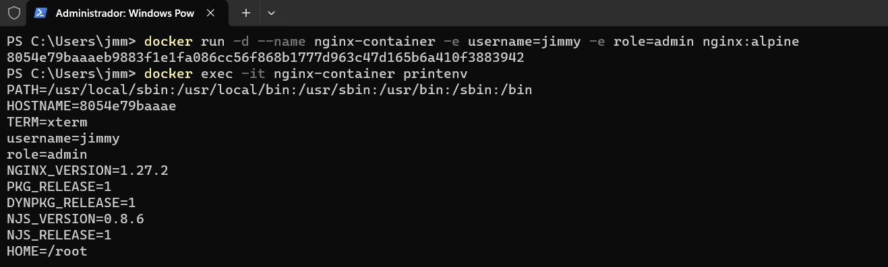
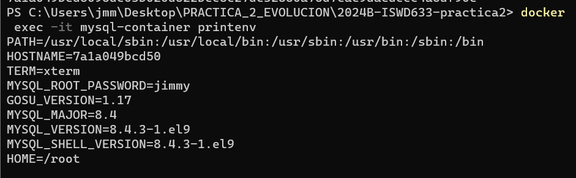

# Variables de Entorno
### ¿Qué son las variables de entorno
```
- Estas son pares de clave-valor, que se usan para configurar el comportamiento que tendran   las aplicaciones y servicios en un contenedos.
- Estas permiten personalizar la configuración evitando modificar el código fuente, facilitando la porabilidad y la gestión de configuraciones en diferentes entornos.
```

### Para crear un contenedor con variables de entorno?

```
docker run -d --name <nombre contenedor> -e <nombre variable1>=<valor1> -e <nombre variable2>=<valor2>
```

### Crear un contenedor a partir de la imagen de nginx:alpine con las siguientes variables de entorno: username y role. Para la variable de entorno rol asignar el valor admin.
```
docker run -d --name nginx-container -e username=jimmy -e role=admin nginx:alpine
8054e79baaaeb9883f1e1fa086cc56f868b1777d963c47d165b6a410f3883942
```



### Crear un contenedor con mysql:8 , mapear todos los puertos
```
docker run -d --name mysql-container -p 3306:3306 mysql:8
se usa este puerto ya que es el predeterminado de mysql
```
### ¿El contenedor se está ejecutando?
```
docker ps
No, el contenedor no se encuentra en ejecución
```

### Identificar el problema
```
El problema es que no se ha especificado la variable de entorno "MYSQL-ROOT_PASSWORD"
docker logs mysql-container
2024-10-25 17:08:51+00:00 [Note] [Entrypoint]: Entrypoint script for MySQL Server 8.4.3-1.el9 started.
2024-10-25 17:08:52+00:00 [Note] [Entrypoint]: Switching to dedicated user 'mysql'
2024-10-25 17:08:52+00:00 [Note] [Entrypoint]: Entrypoint script for MySQL Server 8.4.3-1.el9 started.
2024-10-25 17:08:52+00:00 [ERROR] [Entrypoint]: Database is uninitialized and password option is not specified
    You need to specify one of the following as an environment variable:
    - MYSQL_ROOT_PASSWORD
    - MYSQL_ALLOW_EMPTY_PASSWORD
    - MYSQL_RANDOM_ROOT_PASSWORD
```
### Eliminar el contenedor creado con mysql:8 
```
docker rm -f mysql-container
```
### Para crear un contenedor con variables de entorno especificadas
- Portabilidad: Las aplicaciones se vuelven más portátiles y pueden ser desplegadas en diferentes entornos (desarrollo, pruebas, producción) simplemente cambiando el archivo de variables de entorno.
- Centralización: Todas las configuraciones importantes se centralizan en un solo lugar, lo que facilita la gestión y auditoría de las configuraciones.
- Consistencia: Asegura que todos los miembros del equipo de desarrollo o los entornos de despliegue utilicen las mismas configuraciones.
- Evitar Exposición en el Código: Mantener variables sensibles como contraseñas, claves API, y tokens fuera del código fuente reduce el riesgo de exposición accidental a través del control de versiones.
- Control de Acceso: Los archivos de variables de entorno pueden ser gestionados con permisos específicos, limitando quién puede ver o modificar la configuración sensible.

Previo a esto es necesario crear el archivo y colocar las variables en un archivo, **.env** se ha convertido en una convención estándar, pero también es posible usar cualquier extensión como **.txt**.
```
docker run -d --name <nombre contenedor> --env-file=<nombreArchivo>.<extensión> <nombre imagen>
```
**Considerar**
Es necesario especificar la ruta absoluta del archivo si este se encuentra en una ubicación diferente a la que estás ejecutando el comando docker run.

### Crear un contenedor con mysql:8 , mapear todos los puertos y configurar las variables de entorno mediante un archivo
```
DENTRO DE LA CARPETA CREADA LLAMADA .env SE PUSO DENTRO LO SIGUIENTE: MYSQL_ROOT_PASSWORD=jimmy
PS C:\Users\jmm\Desktop\PRACTICA_2_EVOLUCION\2024B-ISWD633-practica2> New-Item -Path .env -ItemType File


    Directorio:
    C:\Users\jmm\Desktop\PRACTICA_2_EVOLUCION\2024B-ISWD633-practica2


Mode                 LastWriteTime         Length Name
----                 -------------         ------ ----
-a----        10/25/2024   1:27 PM              0 .env


PS C:\Users\jmm\Desktop\PRACTICA_2_EVOLUCION\2024B-ISWD633-practica2> docker
 run -d --name mysql-container --env-file=.env -p 3306:3306 mysql:8
7a1a049bcd5095de03b020d522bce8c27dc32850a75d7cac9dacdeee4a6df90c
```

# CAPTURA CON LA COMPROBACIÓN DE LA CREACIÓN DE LAS VARIABLES DE ENTORNO DEL CONTENEDOR ANTERIOR 


### ¿Qué bases de datos existen en el contenedor creado?
# COMPLETAR
