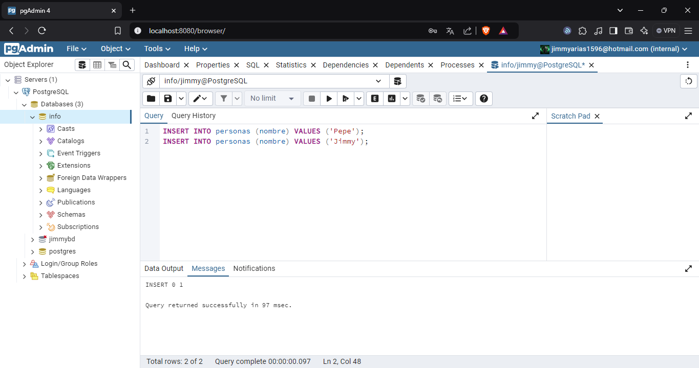

### Crear contenedor de Postgres sin que exponga los puertos. Usar la imagen: postgres:11.21-alpine3.17
```
docker run -d --name postgres-container -e POSTGRES_USER=jimmy -e POSTGRES_PASSWORD=jimmy -e POSTGRES_DB=jimmybd postgres:11.21-alpine3.17
```
### Crear un cliente de postgres. Usar la imagen: dpage/pgadmin4
```
docker run -d --name pgadmin-container -e PGADMIN_DEFAULT_EMAIL=jimmyarias1596@hotmail.com -e PGADMIN_DEFAULT_PASSWORD=jimmy -p 8080:80 dpage/pgadmin4
```
La figura presenta el esquema creado en donde los puertos son:
- a: 8080
- b: 80
- c: 5432


## Desde el cliente
### Acceder desde el cliente al servidor postgres creado.

### Crear la base de datos info, y dentro de esa base la tabla personas, con id (serial) y nombre (varchar), agregar un par de registros en la tabla, obligatorio incluir su nombre.

## Desde el servidor postgresl
### Acceder al servidor
### Conectarse a la base de datos info

### Realizar un select *from personas
